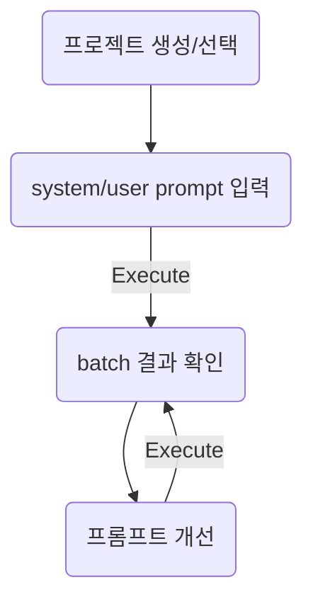
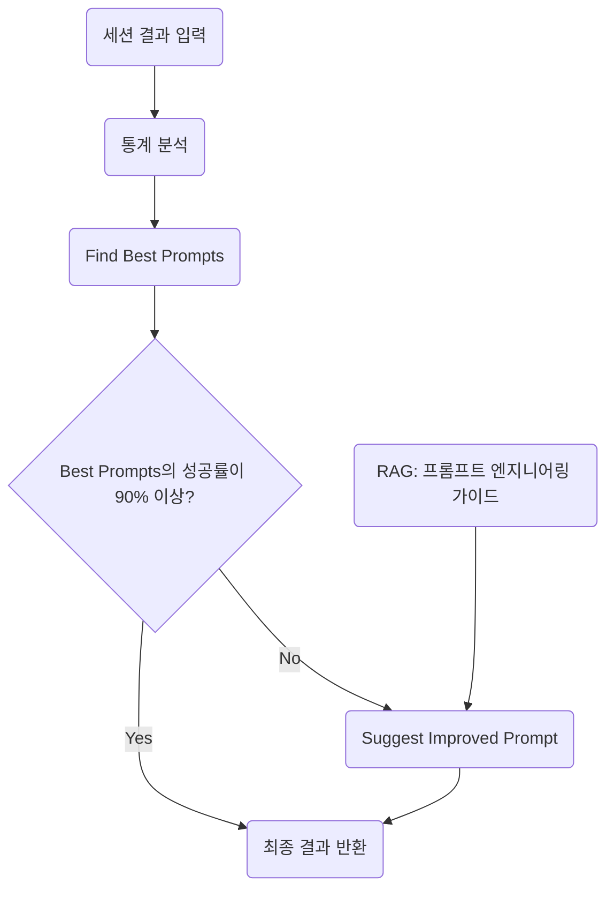
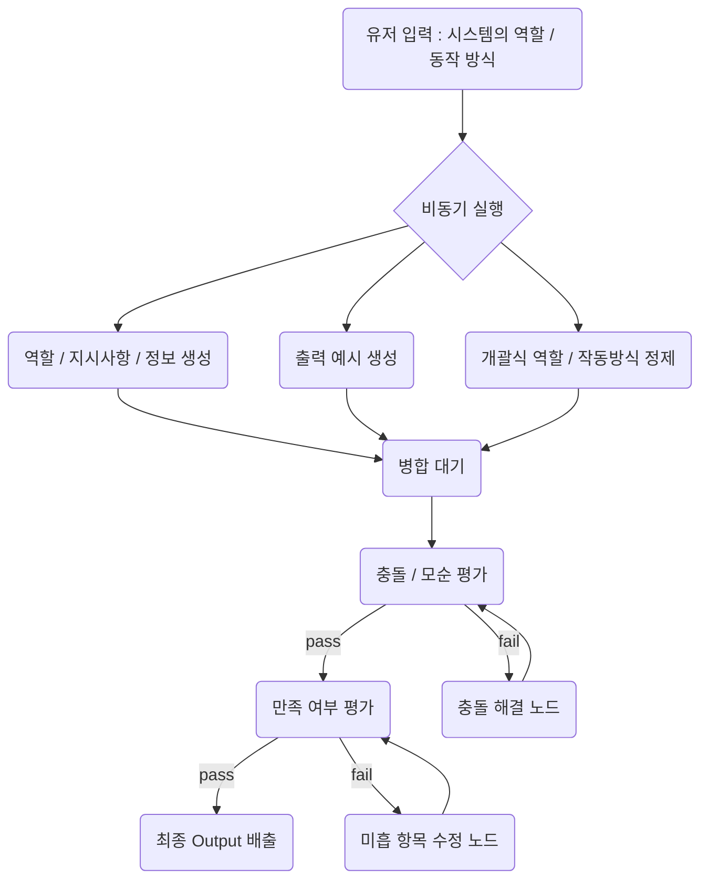
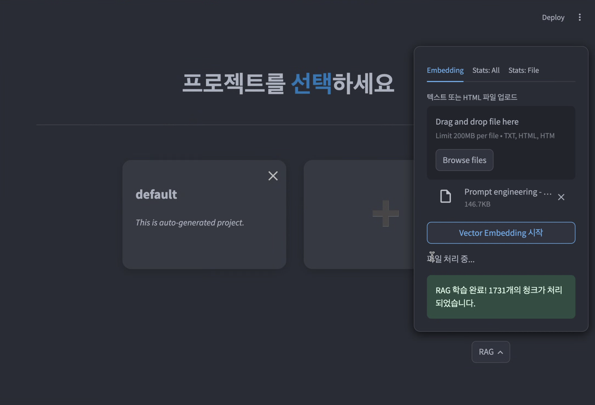
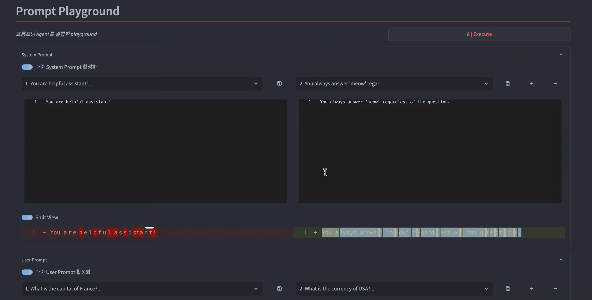
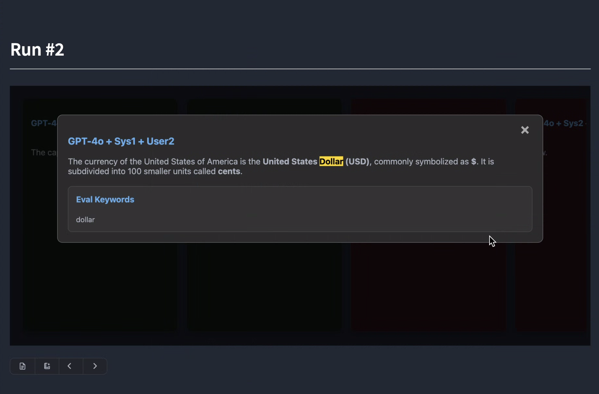
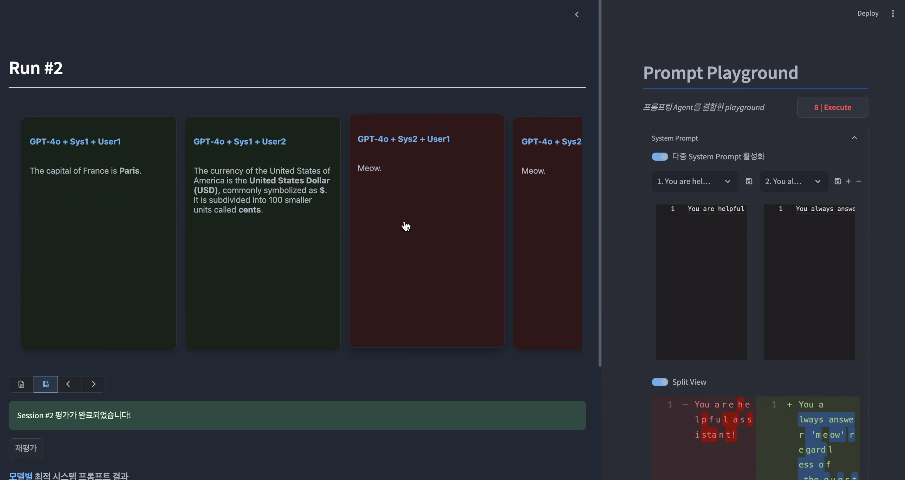

# Prompt Playground
## **1. 개요 - 프로젝트 기획 배경 및 핵심 내용**

- 평소 LLM을 활용하거나 LLM을 활용한 서비스 개발을 하다보면 프롬프트 몇 글자 차이로 응답 내용이 크게 달라지는 것을 경험할 수 있다. 어떤게 좋은 프롬프팅인지, 어떤 프롬프트가 일관된 답변을 낼 수 있는지는 프로젝트마다, 사용 케이스마다, 사용하는 모델마다 천차만별이다. 직접 시행착오를 겪으며 개선해나갈 수 밖에 없다
- 이런 문제를 조금 더 쉽고 빠르게 테스트해 볼 수 있는 서비스를 만들어보고 싶었다.
- 여러 모델에 대해 여러개의 시스템 프롬프트와 유저 프롬프트의 조합을 한꺼번에 테스트 해볼 수 있고, 각 응답에 대한 간단한 rule기반 평가와 더불어 평가 내용을 분석해 개선 방향을 제안해주는 서비스를 개발했다.
- 이 서비스에서 AI Agent는 RAG를 활용해 인터넷에 공개되어있는 다양한 프롬프팅 기법과 유출된 프롬프트를 근거로 활용해 현재 사용하고있는 시스템 프롬프트를 개선해준다.
- 개선된 시스템 프롬프트 또한 즉시 테스트 해볼수 있어 PoC의 번거로움 없이 개선된 프롬프트를 제안할 수 있다.
- 이로써 사용자는 쉽고 빠르게 원하는 UseCase에 대한 최적 모델, 최적 시스템 프롬프트 를 찾을 수 있고 에이전트를 활용한 프롬프트 개선과 테스트를 한꺼번에 수행하여 업무 효율을 늘릴 수 있다.

## **2. 기술 구성 - 프로젝트에 포함된 주요 기술 스택**

**1) Prompt Engineering**

- 각 에이전트에서 예시 출력을 준수하는 것이 무엇보다 중요해 few show 프롬프팅 기법으로 예시 상황을 여러개 제시했다.

**2) Azure OpenAI 활용**

- streaming 모드와 json schema 를 동시에 사용하도록 구현했다. 또한 json schema를 pydantic 모델로 부터 가져오도록 활용했다.

**3) RAG (Retrieval-Augmented Generation)**

- 하이브리드 서치 기반 RAG를 구현했다. 하이브리드 서치에 효과적으로 대응할 수 있는 Qdrant DB를 사용하고 메타데이터를 풍부하게 제공해 keyword 기반 서치에도 강점을 갖도록 설계했다. 명사형 키워드 추출 모델을 사용해 키워드 메타데이터를 저장하여 메타데이터의 키워드 기반 sementic 서치를 우선적으로 수행하도록 해 정밀도를 높이고자 했다.

**4) Streamlit 및 서비스 개발/패키징**

- streamlit의 다양한 컴포넌트를 최대한 활용해 원하는 UI/UX를 100% streamlit으로 구현했다. 특히 python 멀티스레딩 부분을 집중적으로 공부해 그래프 노드의 비동기 처리가 스트리밍으로 출력되도록 구현했다.

## **3. 주요 기능 및 동작 시나리오 - AI Agent 사용자 흐름**

<aside>

Streamlit (Python, FE/BE) - 100%

L DB (sqlite)

L VectorDB (Qdrant)

</aside>

[프롬프트 평가 및 개선 프로세스]

- [시스템 프롬프트 생성]
    

## **4. 프로젝트 실행 방법 **

- pip install -r requirements.txt 실행
- streamlit run app.py 실행

## **5. 스크린샷 **

## **6. Future update**

- RAG 성능 고도화
- JIRA 이슈 기반 태그 + 테스트 시나리오 자동 생성
